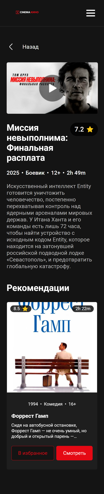
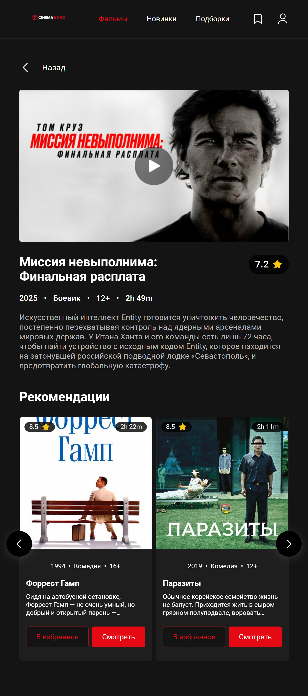
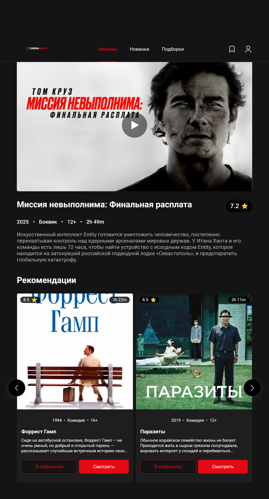

# Итоговый проект в KTS — Cinema (Strapi)

ФИО: Пэкэлэу Даниил  
Тема: Cinema Strapi

## Описание

Небольшое веб‑приложение «Cinema» на React + TypeScript.

Функциональность:

- Каталог фильмов с поиском по названию
- Фильтрация по жанрам (категориям)
- Бесконечная подгрузка (infinite scroll)
- Страница фильма с трейлером и блоком рекомендаций

Данные загружаются из Strapi API.

Текущий Strapi API: https://front-school-strapi.ktsdev.ru/api

## Запуск

### 1) Установка зависимостей

```bash
yarn
```

### 2) Переменные окружения

Создайте файл `.env` в корне проекта и задайте URL до вашего Strapi API:

```bash
VITE_API_URL=https://front-school-strapi.ktsdev.ru/api
```

Для этого проекта можно использовать уже готовый API: https://front-school-strapi.ktsdev.ru/api

### 3) Режим разработки

```bash
yarn dev
```

Откройте адрес, который выведет Vite (обычно `http://localhost:5173`).

### Сборка и предпросмотр

```bash
yarn build
yarn preview
```

### Проверка линтером

```bash
yarn lint
```

## Скриншоты

### Телефон

Главная:


Страница фильма:



### Планшет

Главная:


Страница фильма:



### Ноутбук

Главная:


Страница фильма:



### Десктоп

Главная:


Страница фильма:


## Контакты

- Telegram: @dayz221
- Email: rutuchenal37@gmail.com
- GitHub: https://github.com/Dayz221 
- GitHub твинк =): https://github.com/Dayz21 